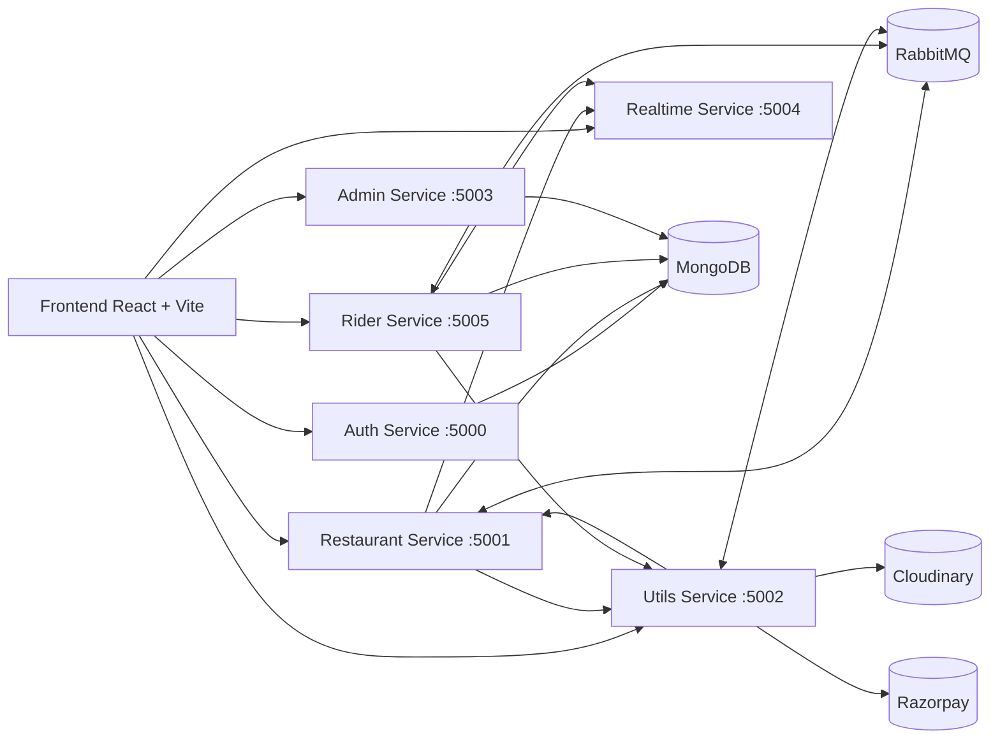

# Tazo

Tazo is a full-stack food delivery platform built with a microservice-style backend and a React frontend.
It supports customer ordering, restaurant operations, rider assignment, real-time updates, payment flow, and admin verification.

## Live Deployment

- Frontend (Vercel): https://tazo-theta.vercel.app/

## Key Features

- Google OAuth login and role-based access (`customer`, `seller`, `rider`, `admin`).
- Restaurant onboarding and profile management.
- Menu item CRUD and availability toggling.
- Customer cart and address management.
- Order placement with distance-aware rider payout logic.
- Razorpay payment flow with async payment confirmation.
- Real-time socket events for:
  - new order alerts to restaurants
  - rider assignment updates
  - rider live location updates
  - nearby rider notifications
- Rider dashboard:
  - profile onboarding
  - online/offline availability toggle
  - current order handling
- Admin dashboard:
  - pending restaurant/rider verification
- Sales dashboard for restaurants:
  - total gross sales
  - delivery/platform fee deductions
  - net sales
  - per-item sales breakdown
- Traffic protection with token-bucket controls:
  - global API throttling across services
  - stricter login rate limiting on auth login endpoint

## Architecture



## Repository Structure

```text
.
|-- frontend/
`-- services/
    |-- auth/
    |-- restaurant/
    |-- utils/
    |-- realtime/
    |-- rider/
    `-- admin/
```

## Service Ports

- Frontend: `5173` (Vite default)
- Auth: `5000`
- Restaurant: `5001`
- Utils: `5002`
- Realtime: `5004`
- Rider: `5005`
- Admin: `5003`

## API Protection (Throttling and Rate Limiting)

Tazo uses token-bucket middleware for request control:

- Global API throttling on services (`auth`, `restaurant`, `utils`, `realtime`, `rider`, `admin`):
  - capacity: `120`
  - refill: `120` tokens per `60s`
  - mode: `throttle` (short wait before rejecting)
  - max wait: `1500ms`

- Login rate limiting on `POST /api/auth/login` only:
  - capacity: `10`
  - refill: `10` tokens per `10 minutes`
  - mode: `limit` (returns `429` immediately when exceeded)

This helps reduce abuse/spikes while keeping normal traffic responsive.

## Tech Stack

- Frontend: React, TypeScript, Vite, Tailwind, React Router, Axios, Socket.IO client.
- Backend: Node.js, Express, TypeScript, Socket.IO.
- Data/Infra: MongoDB, RabbitMQ, Cloudinary, Razorpay.

## System requirements

- Node.js 18+ and npm
- MongoDB running locally or remotely
- RabbitMQ running locally or remotely
- Cloudinary account
- Razorpay account
- Google OAuth client credentials

## Setup

### 1. Clone and enter project

```bash
git clone <your-repo-url>
cd tazo
```

### 2. Install dependencies

Run in each folder:

```bash
cd frontend && npm install
cd ../services/auth && npm install
cd ../restaurant && npm install
cd ../utils && npm install
cd ../realtime && npm install
cd ../rider && npm install
cd ../admin && npm install
```

### 3. Configure environment variables

Create `.env` files in each service folder.

#### `services/auth/.env`

```env
PORT=5000
MONGO_URI=<mongo-connection-string>
JWT_SEC=<jwt-secret>
GOOGLE_CLIENT_ID=<google-client-id>
GOOGLE_CLIENT_SECRET=<google-client-secret>
```

#### `services/restaurant/.env`

```env
PORT=5001
MONGO_URI=<mongo-connection-string>
JWT_SEC=<jwt-secret>
UTILS_SERVICE=http://localhost:5002
REALTIME_SERVICE=http://localhost:5004
INTERNAL_SERVICE_KEY=<internal-shared-secret>
RABBITMQ_URL=<amqp-connection-string>
PAYMENT_QUEUE=PAYMENT_QUEUE
RIDER_QUEUE=RIDER_QUEUE
ORDER_READY_QUEUE=ORDER_READY_QUEUE
```

#### `services/utils/.env`

```env
PORT=5002
RESTAURANT_SERVICE=http://localhost:5001
INTERNAL_SERVICE_KEY=<internal-shared-secret>
RABBITMQ_URL=<amqp-connection-string>
PAYMENT_QUEUE=PAYMENT_QUEUE

CLOUD_NAME=<cloudinary-cloud-name>
CLOUD_API_KEY=<cloudinary-api-key>
CLOUD_SECRET_KEY=<cloudinary-secret>

RAZORPAY_KEY_ID=<razorpay-key-id>
RAZORPAY_KEY_SECRET=<razorpay-key-secret>
```

#### `services/realtime/.env`

```env
PORT=5004
JWT_SEC=<jwt-secret>
INTERNAL_SERVICE_KEY=<internal-shared-secret>
```

#### `services/rider/.env`

```env
PORT=5005
MONGO_URI=<mongo-connection-string>
JWT_SEC=<jwt-secret>
UTILS_SERVICE=http://localhost:5002
RESTAURANT_SERVICE=http://localhost:5001
REALTIME_SERVICE=http://localhost:5004
INTERNAL_SERVICE_KEY=<internal-shared-secret>
RABBITMQ_URL=<amqp-connection-string>
RIDER_QUEUE=RIDER_QUEUE
ORDER_READY_QUEUE=ORDER_READY_QUEUE
```

#### `services/admin/.env`

```env
PORT=5003
MONGO_URI=<mongo-connection-string>
DB_NAME=<admin-db-name>
JWT_SEC=<jwt-secret>
```

#### `frontend/.env`

```env
VITE_INTERNAL_SERVICE_KEY=<internal-shared-secret>
```

## Run Locally

Start each service in a separate terminal:

```bash
cd services/auth && npm run dev
cd services/restaurant && npm run dev
cd services/utils && npm run dev
cd services/realtime && npm run dev
cd services/rider && npm run dev
cd services/admin && npm run dev
```

Start frontend:

```bash
cd frontend && npm run dev
```

Open: `http://localhost:5173`

## Build

```bash
cd frontend && npm run build
cd ../services/auth && npm run build
cd ../restaurant && npm run build
cd ../utils && npm run build
cd ../realtime && npm run build
cd ../rider && npm run build
cd ../admin && npm run build
```

## Notes

- Keep `JWT_SEC` consistent across services that issue/verify JWT.
- Keep `INTERNAL_SERVICE_KEY` identical across internal-calling services.
- Ensure RabbitMQ queues are consistent with `.env` values.
